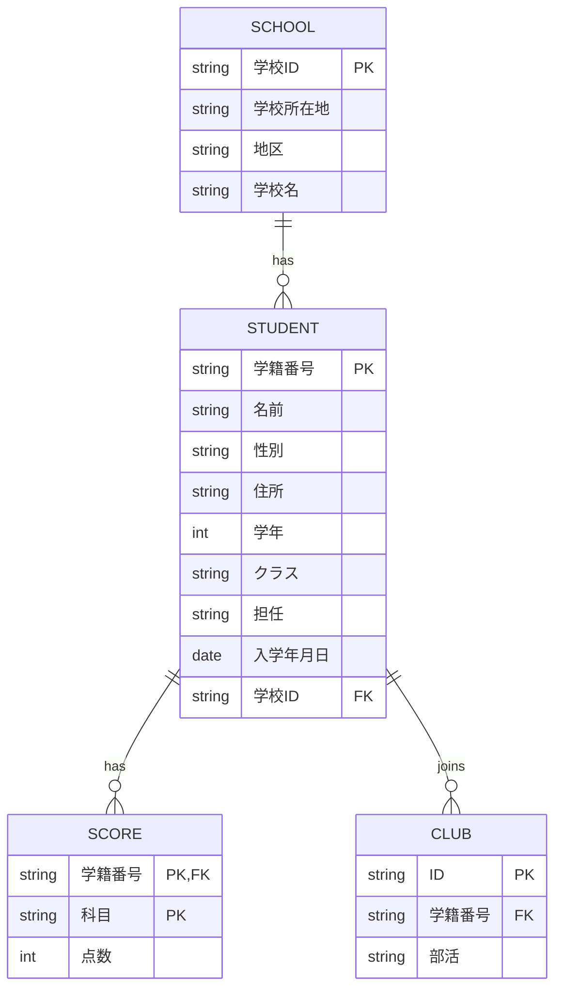

# はじめに
SQL、実行計画の練習用です。
`.env`ファイルのユーザーIDとパスワードをセットしてから、起動してください。

## ER図

```mermaid
erDiagram
  SCHOOL ||--o{ STUDENT : "has"
  STUDENT ||--o{ SCORE : "has"
  STUDENT ||--o{ CLUB : "joins"

  SCHOOL {
    string 学校ID PK
    string 学校所在地
    string 地区
    string 学校名
  }
  STUDENT {
    string 学籍番号 PK
    string 名前
    string 性別
    string 住所
    int    学年
    string クラス
    string 担任
    date   入学年月日
    string 学校ID FK
  }
  SCORE {
    string 学籍番号 PK,FK
    string 科目   PK
    int    点数
  }
  CLUB {
    string ID        PK
    string 学籍番号 FK
    string 部活
  }
```